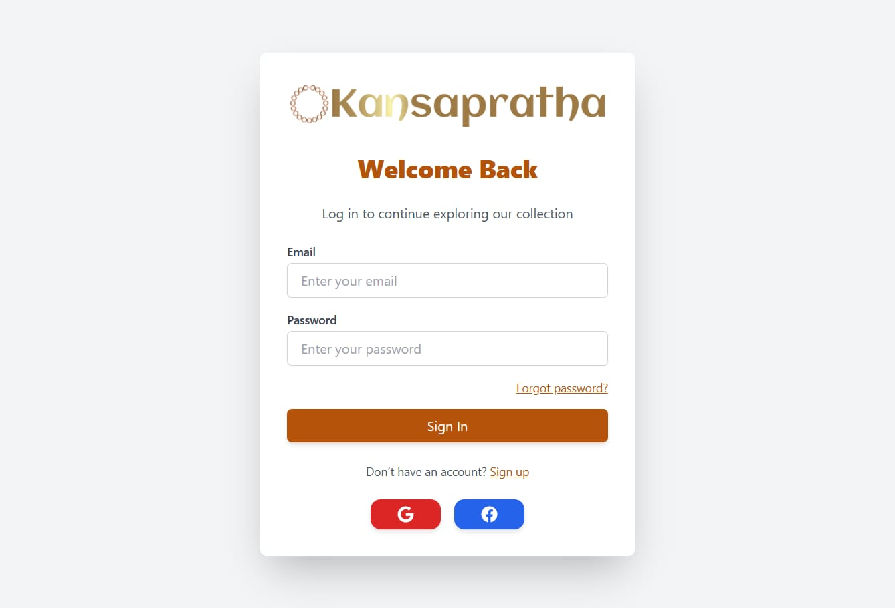
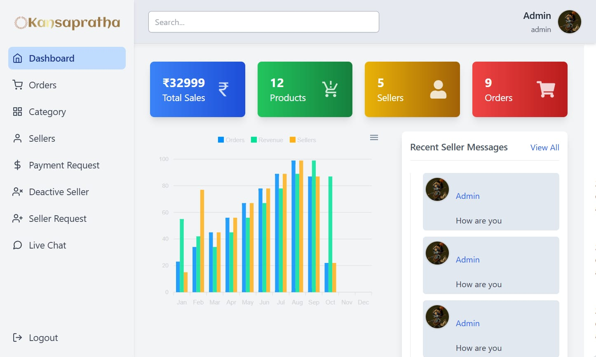
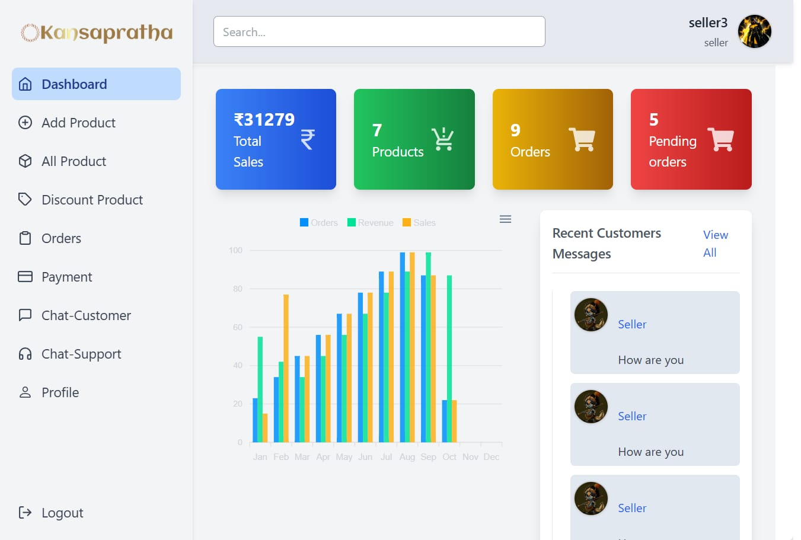

<div align="center">
  
</div>


## Description

KansaPratha is a comprehensive multi-vendor e-commerce platform built with modern web technologies. The platform enables multiple sellers to manage their products and orders while providing customers with a seamless shopping experience. It features a complete ecosystem with customer-facing frontend, seller/admin dashboard, and a robust backend API.

## Website Preview

<div align="center">
  
  
  
  
  
  
  
  
</div>

### Key Features

- **Multi-vendor marketplace** - Support for multiple sellers and their individual shops
- **Customer portal** - Product browsing, cart management, order tracking, and user dashboard
- **Seller dashboard** - Product management, order processing, and analytics
- **Admin panel** - Platform management and oversight
- **Payment integration** - Stripe payment processing
- **Real-time features** - Socket.io for live updates and chat functionality
- **Authentication & Authorization** - JWT-based secure authentication
- **Responsive design** - Mobile-friendly interface with Tailwind CSS
- **Image management** - Cloudinary integration for product images
- **Search functionality** - Advanced product search and filtering
- **Review system** - Customer reviews and ratings
- **Wishlist** - Save products for later
- **Order management** - Complete order lifecycle management

### Tech Stack

**Backend:**
- Node.js with Express.js
- MongoDB with Mongoose ODM
- JWT for authentication
- Socket.io for real-time features
- Stripe for payments
- Cloudinary for image storage
- bcrypt for password hashing

**Frontend:**
- React 18 with React Router
- Redux Toolkit for state management
- Tailwind CSS for styling
- Axios for API calls
- React Hot Toast for notifications
- Lucide React for icons

**Dashboard:**
- React 18 with React Router
- Redux Toolkit for state management
- ApexCharts for analytics
- React Window for virtualization

## Installation

### Prerequisites

- Node.js (v14 or higher)
- MongoDB (local or cloud instance)
- npm or yarn package manager

### Setup Instructions

1. **Clone the repository**
   ```bash
   git clone <repository-url>
   cd kansaPratha2.0
   ```

2. **Backend Setup**
   ```bash
   cd backend
   npm install
   ```
   
   Create a `.env` file in the backend directory with the following variables:
   ```env
   DB_URL=your_mongodb_connection_string
   JWT_SECRET=your_jwt_secret_key
   CLOUDINARY_CLOUD_NAME=your_cloudinary_cloud_name
   CLOUDINARY_API_KEY=your_cloudinary_api_key
   CLOUDINARY_API_SECRET=your_cloudinary_api_secret
   STRIPE_SECRET_KEY=your_stripe_secret_key
   ```

3. **Frontend Setup**
   ```bash
   cd ../frontend
   npm install
   ```

4. **Dashboard Setup**
   ```bash
   cd ../dashboard
   npm install
   ```

## Usage

### Development Mode

1. **Start the Backend Server**
   ```bash
   cd backend
   npm start
   ```
   The backend server will run on `http://localhost:9999`

2. **Start the Frontend Application**
   ```bash
   cd frontend
   npm start
   ```
   The customer frontend will run on `http://localhost:3000`

3. **Start the Dashboard Application**
   ```bash
   cd dashboard
   npm start
   ```
   The seller/admin dashboard will run on `http://localhost:3001`

### Production Build

1. **Build Frontend**
   ```bash
   cd frontend
   npm run build
   ```

2. **Build Dashboard**
   ```bash
   cd dashboard
   npm run build
   ```

3. **Deploy Backend**
   ```bash
   cd backend
   # Set NODE_ENV=production in your environment
   node server.js
   ```

### API Endpoints

The backend provides RESTful APIs for:
- Authentication (`/api/auth`)
- Products (`/api/products`)
- Orders (`/api/orders`)
- Categories (`/api/categories`)
- Payments (`/api/payments`)
- Dashboard analytics (`/api/dashboard`)

### Default Ports

- Backend API: `9999`
- Frontend (Customer): `3000`
- Dashboard (Seller/Admin): `3001`

## Project Structure

```
kansaPratha2.0/
├── backend/                 # Node.js/Express API server
│   ├── controllers/         # Route controllers
│   ├── models/             # MongoDB models
│   ├── routes/             # API routes
│   ├── middleware/         # Custom middleware
│   ├── utilities/          # Helper functions
│   └── server.js           # Main server file
├── frontend/               # Customer-facing React app
│   ├── src/
│   │   ├── components/     # Reusable components
│   │   ├── pages/          # Page components
│   │   ├── store/          # Redux store
│   │   └── utils/          # Utility functions
│   └── public/             # Static assets
└── dashboard/              # Seller/Admin React app
    ├── src/
    │   ├── views/          # Dashboard views
    │   ├── layout/         # Layout components
    │   ├── store/          # Redux store
    │   └── router/         # Routing configuration
    └── public/             # Static assets
```

## License

ISC License

Copyright (c) 2024<div align="center">
  
</div>

# KansaPratha

Permission to use, copy, modify, and/or distribute this software for any purpose with or without fee is hereby granted, provided that the above copyright notice and this permission notice appear in all copies.

THE SOFTWARE IS PROVIDED "AS IS" AND THE AUTHOR DISCLAIMS ALL WARRANTIES WITH REGARD TO THIS SOFTWARE INCLUDING ALL IMPLIED WARRANTIES OF MERCHANTABILITY AND FITNESS. IN NO EVENT SHALL THE AUTHOR BE LIABLE FOR ANY SPECIAL, DIRECT, INDIRECT, OR CONSEQUENTIAL DAMAGES OR ANY DAMAGES WHATSOEVER RESULTING FROM LOSS OF USE, DATA OR PROFITS, WHETHER IN AN ACTION OF CONTRACT, NEGLIGENCE OR OTHER TORTIOUS ACTION, ARISING OUT OF OR IN CONNECTION WITH THE USE OR PERFORMANCE OF THIS SOFTWARE.

---